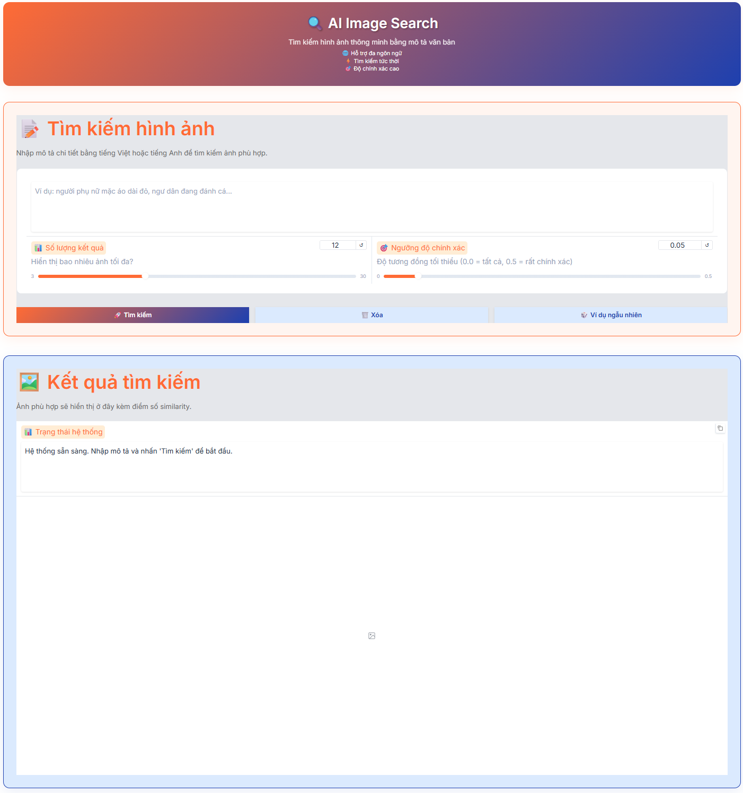

<h2 align="center">
    <a href="https://dainam.edu.vn/vi/khoa-cong-nghe-thong-tin">
    🎓  FACULTY OF INFORMATION TECHNOLOGY (DAINAM UNIVERSITY)
    </a>
</h2>
<h2 align="center">
    HỆ THỐNG TÌM KIẾM HÌNH ẢNH AI
</h2>

<div align="center">
    <p align="center">
        
        
        
    </p>

[](https://www.facebook.com/DNUAIoTLab)
[](https://dainam.edu.vn/vi/khoa-cong-nghe-thong-tin)
[](https://dainam.edu.vn)

</div>

---

## 📖 1. Giới thiệu hệ thống

Hệ thống **Tìm kiếm Hình ảnh AI** được xây dựng dựa trên mô hình **OpenCLIP đa ngôn ngữ (xlm-roberta-base-ViT-B-32)** nhằm:

- Hỗ trợ tìm kiếm hình ảnh người Việt Nam thông qua mô tả văn bản bằng **Tiếng Việt** hoặc **Tiếng Anh**.
- Cung cấp giao diện web hiện đại, thân thiện với **Gradio**, cho phép người dùng nhập mô tả và nhận kết quả tức thì.
- Fine-tune model với **6686+ captions tiếng Việt** để cải thiện độ chính xác trong ngữ cảnh văn hóa Việt Nam.

✨ Các chức năng chính:

- **Fine-tuning với Captions**: Huấn luyện model với dữ liệu captions tiếng Việt để hiểu ngữ cảnh tốt hơn.
- **Tìm kiếm thông minh**: Nhập mô tả chi tiết (áo dài, nón lá, ngư dân, chợ...) và nhận ảnh phù hợp nhất.
- **Embedding Cache**: Lưu trữ embeddings để tăng tốc độ tìm kiếm.
- **Đánh giá Model**: Công cụ evaluation với confusion matrix, accuracy report.

🎯 Mục tiêu hệ thống:

- **Số hóa tra cứu hình ảnh**: Thay thế tìm kiếm thủ công bằng AI thông minh.
- **Tối ưu trải nghiệm**: Giao diện trực quan, kết quả tức thì với điểm similarity.
- **Hỗ trợ đa ngôn ngữ**: Tiếng Việt và Tiếng Anh mà không cần dịch thuật.

## � 2. Các công nghệ được sử dụng

- **Ngôn ngữ:** Python 3.9+
- **Mô hình AI:** OpenCLIP (xlm-roberta-base-ViT-B-32)
- **Framework:** PyTorch, Transformers
- **Giao diện:** Gradio Web UI
- **Phân tích:** NumPy, scikit-learn, seaborn, matplotlib
- **Fine-tuning:** Contrastive Learning với image-caption pairs

<div align="center">

[](https://www.python.org/)
[](https://pytorch.org/)
[](https://github.com/mlfoundations/open_clip)
[](https://gradio.app/)
[](https://numpy.org/)

</div>

## 📁 3. Cấu trúc thư mục

```
ChuyenDoiSo/
├── app.py                          # 🌐 Ứng dụng web tìm kiếm với Gradio UI
├── train.py                        # 🔥 Fine-tuning model & tính embeddings
├── images_dowload.py               # � Script tải ảnh từ Pexels API
├── update_captions.py              # 🔄 Cập nhật metadata sau lọc ảnh
├── models/
│   └── clip_model.py               # 🤖 Wrapper OpenCLIP (encode image & text)
├── utils/
│   ├── data_loader.py              # 📂 Quản lý dataset và embeddings
│   ├── search_engine.py            # 🔍 Logic tìm kiếm và similarity matching
│   └── visualizer.py               # 📊 Công cụ hiển thị kết quả Gradio
├── data/
│   ├── captions_all.json           # 📝 Captions gốc từ Pexels
│   ├── captions_clean.json         # 📝 Captions sau khi lọc thủ công
│   ├── captions_draft.json         # 📝 6686 captions tiếng Việt (fine-tuning)
│   └── processed/                  # 🖼️ 3003 ảnh người Việt Nam đã xử lý
├── trained_models/
│   ├── image_embeddings.pkl        # 💾 Embedding 512-dim của 3003 ảnh
│   ├── fine_tuned_clip_latest.pt   # 💾 Model weights sau fine-tuning
│   ├── text_embeddings_cache.pkl   # 💾 Cache embedding cho query phổ biến
│   └── training_config.json        # ⚙️ Cấu hình training (epochs, batch_size...)
├── .gitignore                      # 🚫 File ignore cho Git
├── requirements.txt                # 📦 Danh sách Python dependencies
└── README.md                       # 📖 Tài liệu hướng dẫn dự án
```

> 💡 **Lưu ý quan trọng**:
>
> - `captions_draft.json`: 6686 captions tiếng Việt dùng để fine-tune model
> - `images_dowload.py`: Chỉ dùng 1 lần để tải ảnh, sau đó có thể bỏ qua
> - `update_captions.py`: Dùng để đồng bộ metadata sau khi lọc ảnh thủ công

## ⚙️ 4. Các bước cài đặt & sử dụng

### 1️⃣ Chuẩn bị môi trường

- Cài đặt **Python 3.9+** → [Tải tại đây](https://www.python.org/downloads/)
- Cài đặt **Git** (optional) → [Tải tại đây](https://git-scm.com/downloads)
- Hệ điều hành: **Windows 10/11**, **Linux**, hoặc **macOS**
- RAM tối thiểu: **8GB** (khuyến nghị 16GB)
- GPU: Không bắt buộc (có GPU sẽ nhanh hơn)

### 2️⃣ Tải source code

- Clone dự án từ GitHub:
  ```bash
  git clone https://github.com/your-repo/ChuyenDoiSo.git
  cd ChuyenDoiSo
  ```
- Hoặc tải file `.zip` → giải nén.

### 3️⃣ Cài đặt dependencies

```bash
pip install -r requirements.txt
```

**Dependencies chính:**

- `torch` - PyTorch framework
- `open-clip-torch` - OpenCLIP model
- `gradio` - Web UI framework
- `pillow`, `numpy` - Xử lý ảnh và tính toán
- `scikit-learn`, `seaborn`, `matplotlib` - Đánh giá model

### 4️⃣ Chuẩn bị dữ liệu (Optional - nếu chưa có)

**Nếu bạn đã có folder `data/processed/` với ảnh sẵn → Bỏ qua bước này!**

**Nếu muốn tự tải ảnh từ đầu:**

1. Lấy API key từ [Pexels](https://www.pexels.com/api/)
2. Cập nhật `PEXELS_KEY` trong `images_dowload.py`
3. Chạy script tải ảnh:
   ```bash
   python images_dowload.py
   ```
4. Lọc ảnh thủ công (xóa ảnh không phù hợp)
5. Cập nhật metadata:
   ```bash
   python update_captions.py
   ```

**Cấu trúc dữ liệu cuối cùng:**

```
data/
├── captions_draft.json    # ✅ 6686 items (image name + captions_vi)
└── processed/             # ✅ 3003 ảnh .jpg
```

### 5️⃣ Kiểm tra dữ liệu

### 5️⃣ Kiểm tra dữ liệu

Đảm bảo cấu trúc thư mục như sau:

```
data/
├── captions_draft.json    # ✅ File captions tiếng Việt (6686 items)
└── processed/             # ✅ 3003 ảnh .jpg/.png
```

**Kiểm tra nhanh:**

```bash
python -c "from pathlib import Path; import json; print(f'Images: {len(list(Path(\"data/processed\").glob(\"*.jpg\")))}'); data=json.load(open(\"data/captions_draft.json\",encoding=\"utf-8\")); print(f'Captions: {len(data)} items')"
```

### 6️⃣ Training model (Fine-tuning + Embeddings)

```bash
python train.py
```

**Quá trình training sẽ:**

1. Load OpenCLIP model (~1.46GB - tải lần đầu sẽ mất ~15-20 phút)
2. Fine-tune model với 6686 captions tiếng Việt (1 epoch, ~515 batches)
3. Tính embeddings cho 3003 ảnh
4. Lưu kết quả vào `trained_models/`:
   - `fine_tuned_clip_latest.pt` - Model weights sau fine-tuning
   - `image_embeddings.pkl` - Embeddings của tất cả ảnh
   - `text_embeddings_cache.pkl` - Cache query phổ biến
   - `training_config.json` - Thông tin cấu hình

**Thời gian dự kiến:**

- **CPU**: 20-40 phút
- **GPU (CUDA)**: 5-15 phút

> 💡 **Lưu ý**: Lần đầu tiên sẽ tải OpenCLIP model từ internet (~1.46GB), mất khoảng 15-20 phút tùy tốc độ mạng.

### 7️⃣ Chạy ứng dụng web

```bash
python app.py
```

**Hệ thống sẽ:**

1. Load dataset (3003 ảnh)
2. Load CLIP model
3. Load embeddings từ `trained_models/`
4. Khởi động Gradio server tại: **http://127.0.0.1:7860**

### 8️⃣ Sử dụng giao diện tìm kiếm

<div align="center">
  <p align="center">
    <br/>
    <i><b>Hình 1:</b> Giao diện tìm kiếm - Nhập mô tả và điều chỉnh tham số</i>
  </p>
  <br/>
  <p align="center">
    <br/>
    <i><b>Hình 2:</b> Kết quả tìm kiếm - Hiển thị ảnh kèm điểm similarity</i>
  </p>
</div>

**Các bước tìm kiếm:**

1. **Nhập mô tả** - Ví dụ: "người phụ nữ mặc áo dài đỏ"
2. **Điều chỉnh tham số**:
   - Số lượng kết quả: 3-30 ảnh
   - Ngưỡng độ chính xác: 0.0-0.5 (càng cao càng strict)
3. **Nhấn "Tìm kiếm"** - Xem kết quả với điểm similarity

### 9️⃣ Ví dụ query phổ biến

**Tiếng Việt:**

- "người phụ nữ mặc áo dài đỏ"
- "trẻ em đang vui chơi"
- "nông dân đang làm việc trên ruộng"
- "cụ già đội nón lá"
- "người bán hàng ở chợ"
- "gia đình Việt Nam sum họp"

**Tiếng Anh:**

- "elderly woman wearing traditional clothes"
- "vietnamese market seller"
- "smiling person in ao dai"
- "Vietnamese family at home"
- "fisherman working on boat"

### 🔟 Kết thúc phiên làm việc

- Đóng trình duyệt hoặc nhấn **Ctrl+C** trong terminal để dừng server
- Embeddings đã được lưu tự động, lần sau không cần train lại

✅ Sau khi hoàn tất các bước trên, bạn đã có thể sử dụng hệ thống **Tìm kiếm Hình ảnh AI** với khả năng hiểu tiếng Việt được fine-tune từ 6686 captions!

## ✨ 5. Tính năng nổi bật

- 🌐 **Đa ngôn ngữ**: Hỗ trợ tìm kiếm bằng Tiếng Việt và Tiếng Anh
- 🧠 **Fine-tuned Model**: Được huấn luyện với 6686 captions tiếng Việt
- ⚡ **Tìm kiếm tức thì**: Kết quả hiện trong vài giây với cosine similarity
- 🎯 **Độ chính xác cao**: Similarity score kèm mỗi kết quả (0.0-1.0)
- 💾 **Embedding Cache**: Lưu embeddings để không cần tính lại
- � **Tải ảnh tự động**: Script `images_dowload.py` tích hợp Pexels API
- 🔄 **Quản lý metadata**: `update_captions.py` đồng bộ sau khi lọc ảnh
- 💻 **CPU/GPU Support**: Tự động detect và tối ưu theo phần cứng
- 🎨 **Giao diện đẹp**: Gradio UI hiện đại với color scheme Đại Nam

## 🧠 6. Quy trình hoạt động

### `images_dowload.py` (Tải dữ liệu)

1. Kết nối với Pexels API sử dụng API key.
2. Tìm kiếm ảnh theo 11 keywords về người Việt Nam.
3. Tải ảnh original và resize về 512x512px.
4. Lưu captions gốc vào `captions_all.json`.
5. Tự động loại bỏ ảnh trùng lặp bằng hash MD5.

### `update_captions.py` (Cập nhật metadata)

1. Đọc `captions_clean.json` (metadata cũ).
2. Lấy danh sách ảnh còn tồn tại trong `data/processed/`.
3. Lọc bỏ entries của ảnh đã xóa thủ công.
4. Lưu metadata mới vào file JSON.

### `train.py` (Training & Fine-tuning)

1. Load mô hình OpenCLIP (xlm-roberta-base-ViT-B-32).
2. **Fine-tuning**: Train với 6686 cặp (ảnh, caption tiếng Việt) sử dụng contrastive learning.
3. **Compute Embeddings**: Encode 3003 ảnh thành vector 512 chiều → lưu `image_embeddings.pkl`.
4. **Text Cache**: Tạo cache cho captions phổ biến → `text_embeddings_cache.pkl`.
5. Lưu config và model weights → `trained_models/`.

### `app.py`

1. Load `image_embeddings.pkl` và cache embeddings.
2. Khởi tạo Gradio web interface với giao diện Đại Nam.
3. Nhận mô tả người dùng → encode text thành vector.
4. Tính cosine similarity với tất cả ảnh.
5. Trả về top-k ảnh có similarity cao nhất, kèm điểm số.

### `models/clip_model.py` (CLIP Wrapper)

1. Load OpenCLIP với model `xlm-roberta-base-ViT-B-32`.
2. Cung cấp phương thức `encode_image()` và `encode_text()`.
3. Xử lý preprocessing (resize, normalize) cho ảnh.
4. Tokenize và encode text thành vector 512-dim.

### `utils/` (Utilities)

- **`data_loader.py`**: Quản lý ImageDataset, load/save embeddings
- **`search_engine.py`**: ImageSearchEngine với cosine similarity matching
- **`visualizer.py`**: Format kết quả cho Gradio Gallery

## 🔧 7. Ghi chú & Khắc phục

### Lỗi thường gặp:

**❌ "Trained model not found!"**

- **Nguyên nhân**: Chưa chạy `train.py`
- **Giải pháp**: `python train.py` để tạo embeddings

**❌ "Dataset trống!"**

- **Nguyên nhân**: Thư mục `data/processed/` không có ảnh
- **Giải pháp**:
  - Option 1: Copy ảnh có sẵn vào `data/processed/`
  - Option 2: Chạy `python images_dowload.py` để tải từ Pexels

**❌ "CUDA out of memory"**

- **Nguyên nhân**: GPU không đủ RAM
- **Giải pháp**: Giảm `batch_size` trong `train.py` (dòng 716) hoặc dùng CPU

**❌ Download model chậm**

- **Nguyên nhân**: Model 1.46GB tải từ Hugging Face lần đầu
- **Giải pháp**:
  - Đợi ~15-20 phút để tải xong
  - Lần sau model sẽ dùng từ cache local (~/.cache/huggingface/)

**❌ "Pexels API limit exceeded"**

- **Nguyên nhân**: Vượt quota API Pexels (200 requests/hour)
- **Giải pháp**: Đợi 1 giờ hoặc đăng ký API key mới

### Tips tối ưu:

- 🚀 **Training nhanh hơn**: Dùng GPU với CUDA nếu có (auto-detect)
- 💾 **Tiết kiệm RAM**: Giảm `batch_size` từ 16→8 (train.py dòng 716)
- 🎯 **Tăng độ chính xác**: Tăng `epochs` từ 1→3 (train.py dòng 715)
- ⚡ **Tìm kiếm nhanh hơn**: Tăng `min_similarity` từ 0.05→0.15
- 📥 **Tải ảnh nhiều hơn**: Sửa `per_page` và `max_pages` trong images_dowload.py
- 🔄 **Re-train từ đầu**: Xóa thư mục `trained_models/` trước khi train

## 📚 8. Tài liệu tham khảo

- [OpenCLIP Paper](https://arxiv.org/abs/2103.00020) - CLIP: Learning Transferable Visual Models
- [OpenCLIP GitHub](https://github.com/mlfoundations/open_clip) - Open source implementation
- [Gradio Documentation](https://gradio.app/docs/) - Web UI framework
- [PyTorch Documentation](https://pytorch.org/docs/) - Deep learning framework
- [XLM-RoBERTa Model](https://huggingface.co/xlm-roberta-base) - Multilingual language model
- [Pexels API](https://www.pexels.com/api/documentation/) - Free stock photos API

## ✉️ 9. Liên hệ

Nếu bạn cần trao đổi thêm hoặc muốn phát triển mở rộng hệ thống, vui lòng liên hệ:

- 👨‍💻 **Tác giả:** [Nguyễn Quang Hiệp]
- 📧 **Email:** [quanghiep2342004@gmail.com]
- 📱 **SĐT:** [0396259480]
- 🌐 **GitHub:** [github.com/NguyenQuangHiep234]
- 🏫 **Trường:** Đại học Đại Nam - Khoa Công nghệ Thông tin

- 👨‍💻 **Đồng tác giả:** [Vũ Đức Anh]
- 📧 **Email:** [anhvuduc9204@gmail.com]
- - 📱 **SĐT:** [********]
- 🌐 **GitHub:** [github.com/******]
- 🏫 **Trường:** Đại học Đại Nam - Khoa Công nghệ Thông tin

<br/>

---

<div align="center">
  <p>© 2025 AIoTLab, Faculty of Information Technology, DaiNam University. All rights reserved.</p>
</div>
